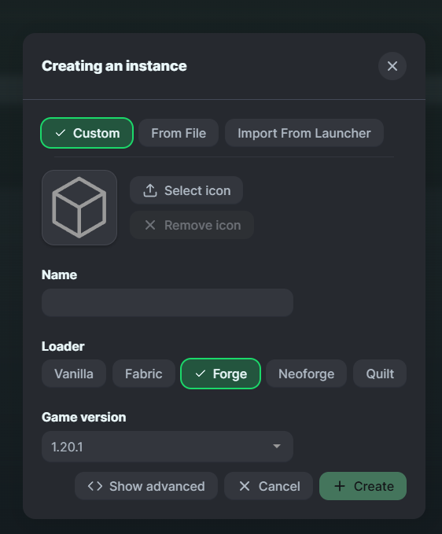
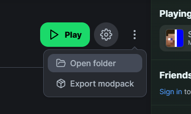
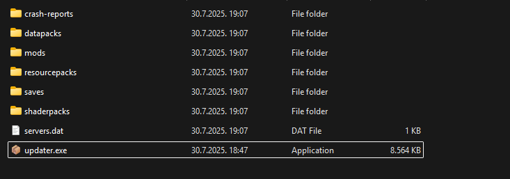

# Server modpack instalacija i updatanje

1. Skini modrinth (https://modrinth.com/)  
2. Napravi novi modpack  
3. Izaberi opciju custom, zatim forge te verziju 1.20.1, Napisi bilo koje ime  
  
4. Otvori folder od modpack-a  
  
5. Skini updater (http://panel.swiftyjax.xyz)  
6. Stavi updater u modpack folder i pokreni ga  
  
7. Nakon zatvaranja terminala, modpack bi trebao biti potpuno instaliran  

Ako trebas password za server, posalji poruku na discord

