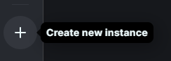

## Instalacija
1. Skini modrinth (https://modrinth.com/)  
2. Napravi novi modpack  
  
4. Izaberi opciju custom, loadera forge, verziju 1.20.1 te upisi ime modpacka (svejedno je)
  
5. Otvori folder od modpack-a  
  
6. Skini updater (http://panel.swiftyjax.xyz)  
7. Stavi updater.exe u modpack folder i pokreni ga
   > Ako se prikaže upozorenje "Windows protected your PC", klikni na "more info", zatim na gumb "Run anyway"  

  
9. Nakon zatvaranja terminala, modpack bi trebao biti potpuno instaliran

## Updateanje
- Ako se prikazuje poruka "Connection closed - mismatched mod channel list", potreban je modpack update
1. Pokreni updater.exe (ako ga nemaš, prati od koraka 5 u poglavlju "Instalacija")
2. Nakon zatvaranja terminala, modpack bi trebao biti na najnovijoj verziji
